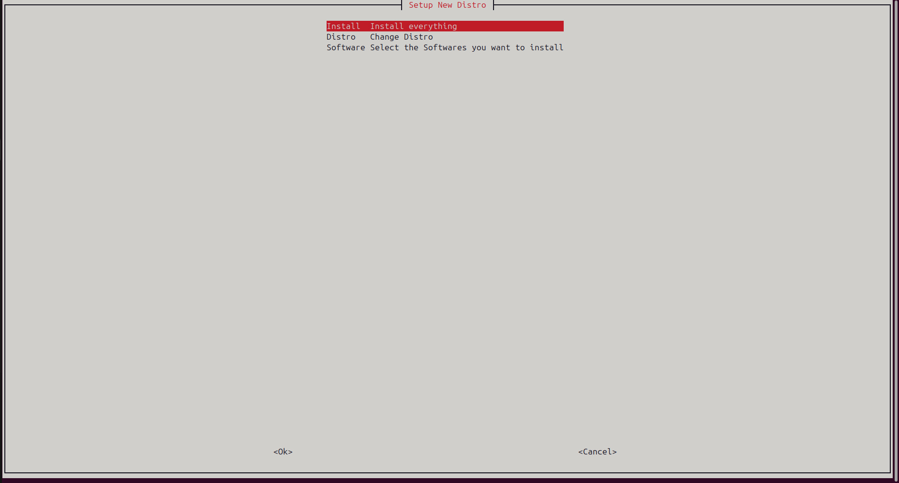
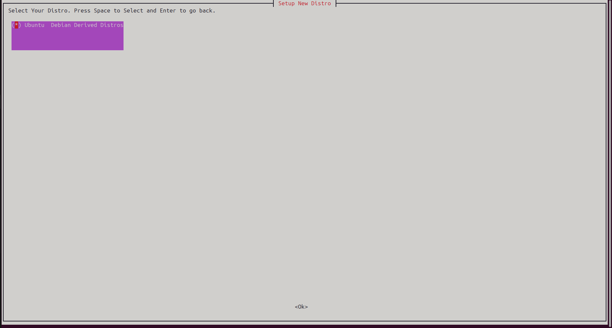
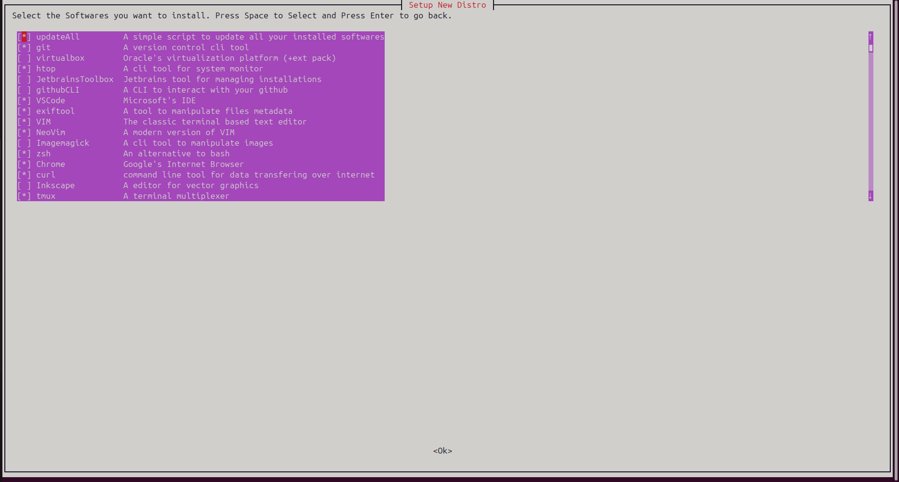

# SETUP NEW DISTRO

This is a simple script to quickly setup a linux distro.

With it, you can select all software you want to install and just wait a few seconds to start using them.





## Start

For this application you may have:

- a Debian based distro (arch based in the future)
- whiptail
- bash

Then run:

```bash
chmod +x ./setup
./setup
```
